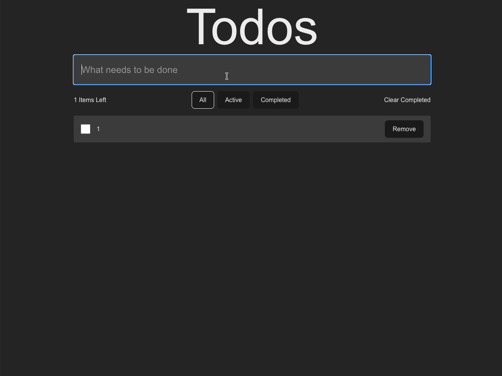

**Deskripsi**

Ini adalah aplikasi todo list yang dibuat untuk memenuhi persyaratan BNSP di Widyatama sebagai Junior Web Programmer.

**Preview Aplikasi**



**Author**

- **Nama**: Huda Prasetyo
- **NIM**: 41121200005
- **Institusi**: Universitas Widyatama

**Fitur**

- **List**: Menampilkan daftar todo yang tersimpan.
- **Create**: Menambahkan todo baru melalui form.
- **Update (Check)**: Menandai todo sebagai selesai / belum selesai.
- **Delete**: Menghapus todo dari daftar.
- **Filtering By Status**: Memfilter todo berdasarkan status (All / Active / Completed).

**Struktur Folder**

- **`/app`**: Root aplikasi Next.js (route, layout, halaman). File utama berada di `app/page.tsx` dan `app/layout.tsx`.
- **`/src/components`**: Komponen UI seperti `form.tsx`, `list.tsx`, `list-item.tsx`, dan `filter.tsx`.
- **`/src/actions`**: Action server-side (mis. `todo.action.ts`) untuk operasi yang berhubungan dengan Prisma.
- **`/src/libs`**: Utility library, termasuk `prisma.ts` yang mengekspor instance Prisma Client.
- **`/src/mutations`**: Hooks/custom logic untuk mutation (create, update, remove, clear completed).
- **`/src/schemas`**: Skema validasi (mis. `todo.schema.ts`) menggunakan `zod`.
- **`/src/types`**: Tipe TypeScript khusus aplikasi (mis. `todo.type.ts`).
- **`/src/utils`**: Utilitas kecil seperti `action.util.ts`.
- **`/prisma`**: Skema Prisma (`schema.prisma`) dan folder migrasi (`/prisma/migrations`). Project ini menggunakan SQLite sebagai database.
- **`/public`**: Aset publik (gambar, favicon, dll).
- **Root files**: `package.json`, `tsconfig.json`, `next.config.ts`, dan konfigurasi build seperti `postcss.config.mjs`, `eslint.config.mjs`.

**Menjalankan / Install Aplikasi**

Persyaratan:

- **Runtime**: Bun (direkomendasikan) atau Node.js
- **Database**: SQLite (terkonfigurasi melalui Prisma)
- **Bahasa**: TypeScript
- **Framework**: Next.js v16

Langkah singkat untuk menjalankan secara lokal:

1. Install dependencies

```zsh
bun install
```

2. Generate Prisma Client

```zsh
npx prisma generate
```

3. Terapkan migrasi (opsi):

- Untuk development (menciptakan/melakukan migrate & seeding jika diperlukan):

```zsh
npx prisma migrate dev
```

- Jika Anda hanya ingin menerapkan migrasi yang sudah ada (deploy):

```zsh
npx prisma migrate deploy
```

4. Jalankan server development

```zsh
bun run dev
```

Catatan:

- `package.json` memiliki `postinstall` script `prisma generate`, sehingga setelah `bun install` biasanya Prisma Client otomatis di-generate.
- Jika Anda menggunakan Node.js/npm, ganti `bun install` dengan `npm install` dan jalankan script dengan `npm run <script>`.

**Konfigurasi Database**

- File konfigurasi Prisma ada di `prisma/schema.prisma`. Secara default project ini menggunakan provider `sqlite` dan menyimpan file database lokal (mis. `dev.db`) di folder yang ditentukan di schema.
